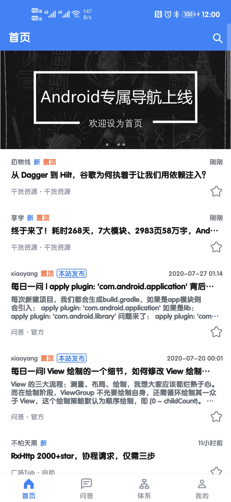

### WanAndroidMVVM
- 该项目基于 [张鸿洋](https://github.com/hongyangAndroid) 大佬的 [玩Android](https://www.wanandroid.com/blog/show/2) 接口
- 项目采用 Kotlin 语言
- 整体采用  MVVM 架构编写
- 使用到的 JetPack组件有 LiveData 、 ViewModel 、 Lifecycles 、 DataBinding 、 Navigation 、 Paging 3.0

### 已有功能

- 首页最新文章
- 搜索
- 每日一问文章列表
- 广场文章列表
- 项目文章列表
- 知识体系
- 网站导航
- 公众号
- 收藏、分享文章
- 代办清单
- 用户详细页
- 积分详细、排名
- 夜间模式

### 计划添加的功能

- 混淆配置
- WebFragment 点击事件
- 主题色选择（夜间模式时无效）
- 。。。。。。

### 待完善功能

- 冷启动闪屏
- 积分排名界面
- 部分功能的实现逻辑
- 主题颜色的统一
- 夜间模式

### 特别感谢

- [玩Android 网站  -  鸿洋大佬](https://www.wanandroid.com/)
- [Kotlin - JetBrains](https://github.com/JetBrains/kotlin)
- [Kotlinx.Coroutines - Kotlin](https://github.com/Kotlin/kotlinx.coroutines)
- [Retrofit - Square](https://github.com/square/retrofit)
- [OkHttp - Square](https://github.com/square/okhttp)
- [Gson - Google](https://github.com/google/gson)
- [Coil - coil-kt](https://github.com/coil-kt/coil)
- [PersistentCookieJar - franmontiel](https://github.com/franmontiel/PersistentCookieJar)
- [CircleImageView - hdodenhof](https://github.com/hdodenhof/CircleImageView)
- [BaseRecyclerViewAdapterHelper - CymChad](https://github.com/CymChad/BaseRecyclerViewAdapterHelper)
- [MMKV - Tencent](https://github.com/Tencent/MMKV)
- [AgentWeb - Justson](https://github.com/Justson/AgentWeb)
- [banner - youth5201314](https://github.com/youth5201314/banner)
- 最后在厚脸皮的贴一下自己简单封装的、还有很多问题的 [MVVM Library](https://github.com/RobbinM/MVVMScaffold)

### 支持一下

如果本项目对你有帮助，请点击右上角的 **start** 支持一下

目前学习Android差不多有一年了，还有很多很多的知识没有学习到，如果各位大佬发现项目中的问题或者错误的实现方式时，可以提 **issue** ，纠正我的错误，谢谢 ヾ(≧O≦)〃嗷~

### 项目截图

|                        首页                        |                          每日一问                          |                             广场                             |
| :------------------------------------------------: | :--------------------------------------------------------: | :----------------------------------------------------------: |
|  |  |  |

|                      知识体系                      |                       知识体系文章列表                       |                            公众号                            |
| :------------------------------------------------: | :----------------------------------------------------------: | :----------------------------------------------------------: |
|  |  |  |

|                      我的                      |                            积分                            |                         我的收藏                         |
| :--------------------------------------------: | :--------------------------------------------------------: | :------------------------------------------------------: |
|  |  |  |

|                          我的分享                          |                      待办清单                      |                          添加代办                          |
| :--------------------------------------------------------: | :------------------------------------------------: | :--------------------------------------------------------: |
|  |  |  |

|                     浏览网页                     |                         项目列表                         |      |
| :----------------------------------------------: | :------------------------------------------------------: | ---- |
|  |  |      |

**夜间模式**

|                             首页                             |                           每日一问                           |                             广场                             |
| :----------------------------------------------------------: | :----------------------------------------------------------: | :----------------------------------------------------------: |
|  |  |  |

|                           知识体系                           |                       知识体系文章列表                       |                            公众号                            |
| :----------------------------------------------------------: | :----------------------------------------------------------: | :----------------------------------------------------------: |
|  |  |  |

|                           我的                           |                             积分                             |                           我的收藏                           |
| :------------------------------------------------------: | :----------------------------------------------------------: | :----------------------------------------------------------: |
|  |  |  |

|                           我的分享                           |                           代办清单                           |                           添加代办                           |
| :----------------------------------------------------------: | :----------------------------------------------------------: | :----------------------------------------------------------: |
|  |  |  |

|                          浏览网页                          |                           项目列表                           |      |
| :--------------------------------------------------------: | :----------------------------------------------------------: | ---- |
|  |  |      |

